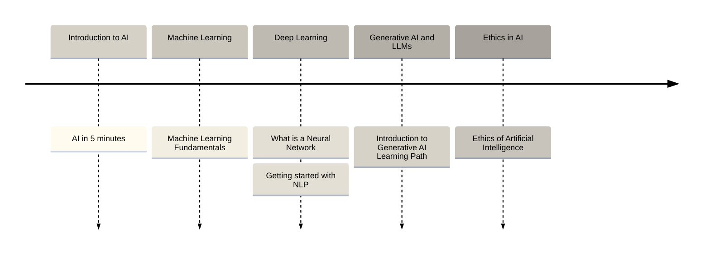

# Gorilla Logic AI Learning Path

> [!NOTE]
> Updated: February 2024. We will work to keep this learning path up to date. If you have any suggestions or feedback, please let us know in the artificial-intelligence Slack channel. Happy learning!

Welcome to our comprehensive Learning Path on Artificial Intelligence (AI)!

AI has become an indispensable part of our daily existence, revolutionizing how we interact with the world around us. From customizing our social media experiences to improving weather prediction accuracy, AI's influence permeates every aspect of our lives.

In an era where technology increasingly shapes our lives and future, understanding the nuances of AI is no longer optional but essential for everyone. Regardless of your profession or background, knowing the basics of the field will enable you to navigate the changing landscape better, make informed decisions, and capture new opportunities.

We have formulated this learning path to prepare you with the knowledge needed to explore the vast potential of AI. It does not mean you will know everything about AI after following this path. It means you will have the basics to decide whether you want to continue delving more deeply into the field or have enough information to successfully kick off your AI conversations.

## The Learning Path Structure

We've structured your journey through the fascinating field of AI using a three-level scale: Introductory, Intermediate, and Advanced. This approach offers different options for each topic based on your knowledge and technical expertise, ensuring a smooth and comprehensive learning experience.

- **Introductory** - Labeled across the document with the icon 🌱: These are resources to start your journey with the fundamentals of each topic. This first level is formulated for those new to the field, laying a solid foundation and easing you into artificial intelligence.

- **Intermediate** - Labeled across the document with the icon 🌿: These resources include more complex concepts and applications. This middle level builds on the basics, introducing you to a broader range of topics and challenges.

- **Advanced** - Labeled across the document with the icon 🌳: It's a path built for those ready to delve into the most challenging aspects of each topic; this level will challenge you to master advanced techniques and explore cutting-edge approaches.

Some examples of how to tackle the different levels:

- If you are new to AI and want to get a general understanding of the field, you can follow the introductory resources. This way, you will have a big picture of the field and decide whether to continue learning about it. We have created a brief example that you can see in the following image.
- If you are eager to be a specialist in the field, the advanced resources will be your best option. You will have a deep understanding of the topic and will be able to apply it in real life.

### Example of a Learning Path for beginners

**Note**: Mapping a Learning Path is not an exact science. We have made it as comprehensive as possible. Nevertheless, you can always try different resources and see which fits you best. [Microsoft's AI For Beginners](https://microsoft.github.io/AI-For-Beginners/), for instance, looks like an interesting course.

Awesome! We are ready to start our journey.

## Introduction to AI

> [!NOTE]
> While navigating the learning path, please remember that the resources are labeled with the icons 🌱 (Introductory), 🌿 (Intermediate), and 🌳 (Advanced) to indicate the level of complexity. Choose the resources that best fit your current knowledge and expertise.

Welcome to the beginning of our journey into the fascinating world of AI, a field of Computer Science that enables machines to imitate human intelligence, perform tasks, and make decisions independently by combining algorithms, data, and insights.

As expected, we must start with a brief introduction to the topic. It covers the foundation for your understanding of AI, including its core principles, key areas, and impact on society and industries. By exploring the basics, you will gain a comprehensive overview of what AI means and its significance in today's digital age.

Below, you will find resources to help you get started with AI.

- 🌱 [AI in 5 minutes](https://www.youtube.com/watch?v=uMzUB89uSxU)
- 🌿 [What is AI? A Quick-Start Guide](https://www.datacamp.com/blog/what-is-ai-quick-start-guide-for-beginners)
- 🌳 To delve deeper into advanced topics, we encourage you to review the rest of the document.

## Probability and Statistics

> [!NOTE]
> If you are new to AI and only want to get a general understanding of the field, this topic could be optional in your learning path.

As we delve deeper into AI, the second step is learning about Probability and Statistics. These mathematical foundations are crucial for understanding and developing AI models.

Probability offers the tools for quantifying uncertainty and making informed predictions about future events. Statistics enables us to analyze and infer patterns from data, which is essential for training AI algorithms to recognize complex patterns.

- 🌱 [Why is statistics important in Data Science](https://towardsdatascience.com/why-is-statistics-important-in-data-science-machine-learning-and-analytics-92b4a410f686) and [Probability Theory & Descriptive Statistics](https://tawheedyousuf.medium.com/probability-theory-descriptive-statistics-2e35d1dab20a)
- 🌿 [Udemy - Statistics for Business Analytics](https://gorillalogic.udemy.com/course/data-statistics/) or [Statistics and Probability](https://www.youtube.com/watch?v=w1Aozoynr6M)
- 🌳 [Introduction to Statistics: Stanford](https://www.coursera.org/learn/stanford-statistics)

## Python Programming

The third step on our learning path introduces you to Python Programming. Python is a widely used programming language in AI for its readability and vast ecosystem of libraries. It is the cornerstone for efficiently building, testing, and deploying AI models.

This section will cover the fundamentals of Python programming, focusing on syntax, data structures, functions, and object-oriented programming principles. It will dive into how Python's powerful libraries, such as NumPy or Pandas, handle data processing, analysis, and visualization.

- 🌱 [Learn Python](https://www.kaggle.com/learn/python)
- 🌿 [Introduction to Programming with Python](http://cs50.harvard.edu/python/2022/) or [Udemy - Python For Data Science](https://gorillalogic.udemy.com/course/python-coding/)
- 🌳 [Python Data Science Handbook](https://jakevdp.github.io/PythonDataScienceHandbook/)

## Machine Learning

Great! Moving forward to the next crucial topic in our AI learning path, the fourth step introduces you to the rapidly evolving field of Machine Learning. ML is at the heart of AI, enabling computers to learn from data, adapt to new situations, and improve their decision-making over time without being explicitly programmed for each task.

This topic will explore the core concepts, including supervised, unsupervised, and reinforcement learning. You'll learn about the fundamental algorithms that drive ML models, such as regression, decision trees, or neural networks, and how they are applied to solve real-world problems.

- 🌱 [Machine Learning Fundamentals](https://nyandwi.com/machine_learning_complete/11_ml_fundamentals/) or [Udemy - What is Machine Learning?](https://www.udemy.com/course/what-is-machine-learning/)
- 🌿 [Udemy - Machine Learning A-Z](https://gorillalogic.udemy.com/course/machinelearning/) or [Open Machine Learning Course](https://mlcourse.ai/book/index.html) 
- 🌳 [Machine Learning with Python: MITx](https://www.edx.org/learn/machine-learning/massachusetts-institute-of-technology-machine-learning-with-python-from-linear-models-to-deep-learning)

## Deep Learning

Congratulations on reaching this advanced stage in our AI learning path!

You've now learned the fundamental concepts of Python programming and Machine Learning. You are ready to explore the cutting-edge Deep Learning (DL) domain. Deep Learning, an advanced subset of Machine Learning, uses neural networks with multiple layers to process vast amounts of data. This enables machines to recognize complex patterns and perform tasks with remarkable accuracy.

As we embark on this section, you'll discover how deep learning models, inspired by the human brain's architecture, are revolutionizing industries and shaping the future of technology.

- 🌱 [What is a Neural Network](https://www.youtube.com/watch?v=aircAruvnKk)
- 🌿 [Neural Networks and Deep Learning](http://neuralnetworksanddeeplearning.com/) or [Udemy - Deep Learning A-Z](https://gorillalogic.udemy.com/course/deeplearning/)
- 🌳 [Practical Deep Learning for Coders](https://course.fast.ai/)

### Natural Language Processing (NLP)

NLP is a branch of artificial intelligence focused on enabling computers to understand, interpret, and generate human language in a way that is both meaningful and contextually relevant. If you are interested in this field, you can start with the following resources:

- [Getting started with NLP](https://www.kaggle.com/code/jhoward/getting-started-with-nlp-for-absolute-beginners)
- [Natural Language Processing With spaCy](https://realpython.com/natural-language-processing-spacy-python/)

## Generative AI & LLMs

You have now reached a fascinating frontier: Generative AI and Large Language Models (LLMs). This innovative segment of AI focuses on creating algorithms that can generate novel content — text, images, music, or even code — reproducing the creativity and complexity of human output.

This section will explain how LLMs learn from vast datasets to produce original content. We will explore the architecture behind the models and provide you with the practical skills to leverage these technologies for innovative applications.

- 🌱 [Introduction to Generative AI Learning Path](https://www.cloudskillsboost.google/paths/118)
- 🌿 [The Illustrated Transformer](https://jalammar.github.io/illustrated-transformer/), [Transformers from Scratch](https://e2eml.school/transformers), and [The Novice's LLM Training Guide](https://rentry.org/llm-training)
- 🌳 [Generative AI with Large Language Models](https://www.coursera.org/learn/generative-ai-with-llms) or [Large Language Model Course - GitHub](https://github.com/mlabonne/llm-course)

## Ethics in AI

We cannot finish our AI learning path without exploring this critical topic. In this concluding section, we will dive into the challenges related to developing and deploying AI systems. You will explore topics such as bias and fairness, privacy and security, transparency and accountability, and the societal impacts of AI. This exploration of Ethics in AI serves as a reminder that technology's true value lies not just in its capabilities but in how it is used to enhance the human experience, promote societal well-being, and safeguard fundamental rights and values.

- [Ethics of Artificial Intelligence](https://www.unesco.org/en/artificial-intelligence/recommendation-ethics)
- [Ethics in Generative AI](https://www.datacamp.com/tutorial/ethics-in-generative-ai)

## Additional Resources

As you conclude this learning path, remember that your journey in AI is just beginning. The field of AI is dynamic and ever-evolving, with new challenges and opportunities emerging constantly. Let this be not an end but a launchpad for continuous learning and impactful innovation in AI.

We will continuously list here some additional resources that you can use to continue your learning journey:

- [LLM Inference Performance Engineering](https://www.databricks.com/blog/llm-inference-performance-engineering-best-practices)
- [Finetuning Large Language Models](https://www.deeplearning.ai/short-courses/finetuning-large-language-models/)
- [LLM security](https://llmsecurity.net/)

A cool resource showing visualizations of the most popular LLMs is available here:

- [LLM Visualization](https://bbycroft.net/llm)
